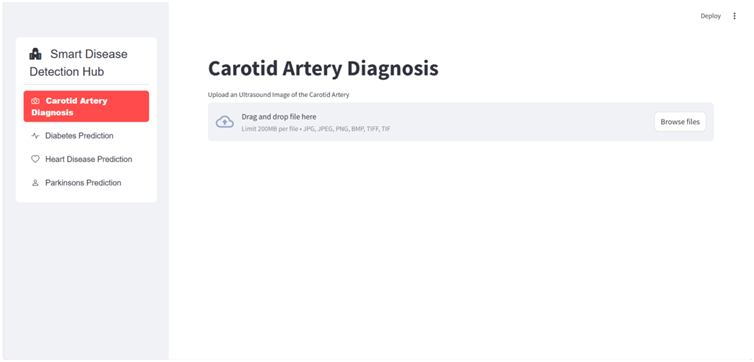
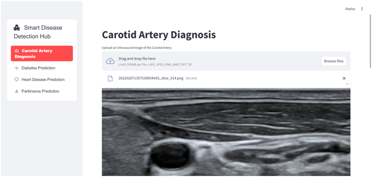
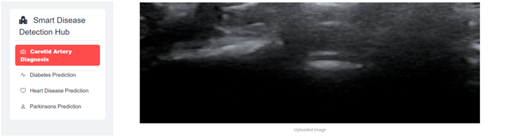
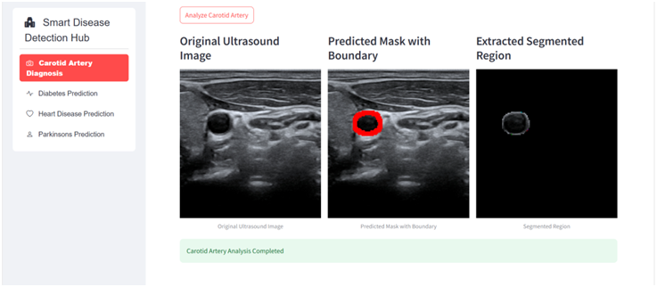
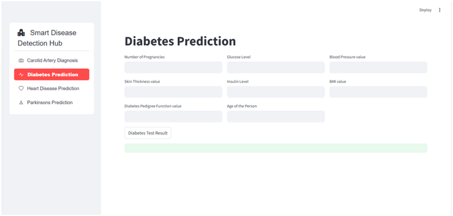
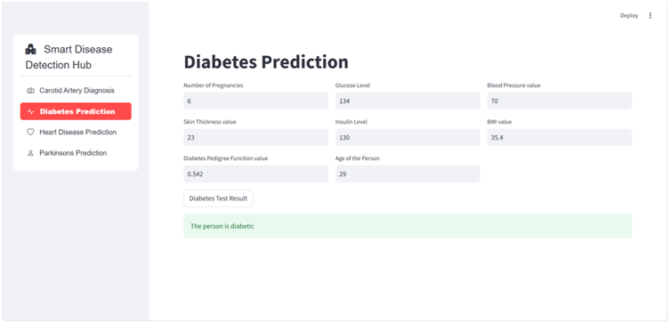
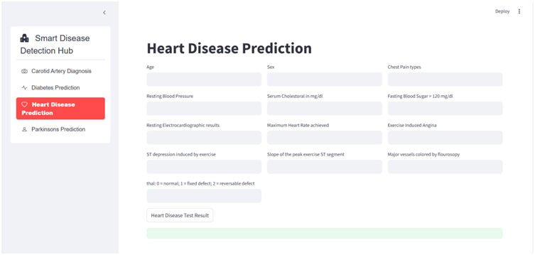
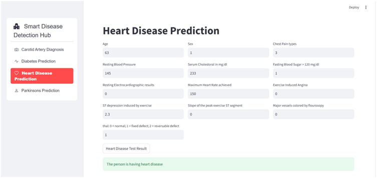
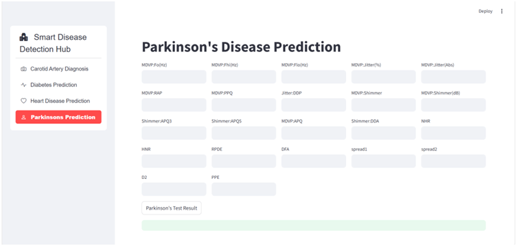
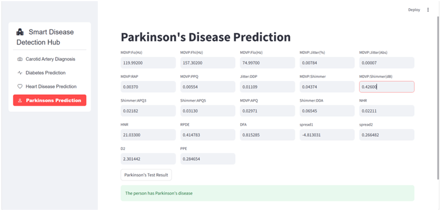

# AI-Powered Multidisciplinary Health Diagnosis System

> **Multiple Disease Prediction Streamlit App** — A unified, extendable system that leverages machine learning and deep learning models to predict multiple health conditions from different inputs (tabular data, images, user symptoms) and presents results through an interactive Streamlit web app.

---

## 🚀 Project Overview

This repository contains the complete codebase, assets, datasets, trained model files, and Colab notebooks used to build **AI-Powered Multidisciplinary Health Diagnosis System** — a research-grade proof-of-concept that demonstrates how multiple predictive models (for diseases such as diabetes, heart disease, pneumonia, carotid artery diagnosis, Parkinson's, etc.) can be trained, saved, and integrated into an end-to-end web application for quick clinical-like screening.

Key goals:

* Provide an easy-to-run Streamlit demo (`app.py`) for inference on multiple disease models.
* Include training notebooks (Colab) and datasets so other researchers can reproduce and improve the models.
* Ship pre-trained models (in `saved_models/`) for fast prototyping and demonstration.

---

## 🔍 Features

* Predict multiple diseases using separate specialized models (tabular and image-based).
* Simple Streamlit UI for uploading inputs and viewing predictions/explanations.
* Notebooks to train and evaluate models (Colab-friendly).
* Organized datasets and saved model artifacts for reproducibility.
* Quick local setup via `requirements.txt` or `pip install -r requirements.txt`.

---

## 🧭 Repo Structure (high-level)

```
AI-Powered-Multidisciplinary-Health-Diagnosis-System/
├── Colab_files_to_train_model/       # Training notebooks (Google Colab-ready)
├── assest/                           # Visual assets (screenshots and result images)
│   └── screenshot/                   # Actual screenshot folder used in the project
│       ├── Carotid_Artery_Diagnosis.png
│       ├── Carotid_Artery_Diagnosis_Result1.png
│       ├── Carotid_Artery_Diagnosis_Result2.png
│       ├── Carotid_Artery_Diagnosis_Result3.png
│       ├── Diabetes_Prediction.png
│       ├── Diabetes_Prediction_Result.png
│       ├── Heart_Disease_Prediction.png
│       ├── Heart_Disease_Prediction_Result.png
│       ├── Parkinson_Disease_Prediction.png
│       └── Parkinson_Disease_Prediction_Result.png
├── dataset/                          # Raw & processed datasets used for training
├── saved_models/                     # Trained model files (Keras .h5, sklearn .pkl, etc.)
├── AI-Powered Multidisciplinary Health Diagnosis System.pdf  # Project report / documentation
├── app.py                            # Streamlit application (entry point)
├── requirements.txt                  # Python dependencies
├── README.md                         # (This file)
└── .gitignore
```

> **Note:** The actual screenshot images live under `assest/screenshot/`. Please keep the directory names consistent (consider renaming `assest` → `assets` if you want the standard spelling). If you rename folders, update any path references in `app.py` and other scripts.

---

## 🧩 Screenshots & Results

The images below reference the files stored in `assest/screenshot/`. Make sure these exact files exist in your repo before pushing or linking to them in the README.

### Carotid Artery Diagnosis

* Input / Overview
  
* Result examples
  
  
  

### Diabetes Prediction

* Input
  
* Result
  

### Heart Disease Prediction

* Input
  
* Result
  

### Parkinson's Disease Prediction

* Input
  
* Result
  

> If you have more result images (confusion matrices, ROC curves, training loss/accuracy graphs), consider adding them to `assest/screenshot/metrics/` and linking them here with captions indicating the model and dataset used.

---

## 🛠️ Tech Stack

* Python 3.8+ (recommended)
* Machine learning: scikit-learn
* Deep learning: TensorFlow / Keras
* App / UI: Streamlit
* Computer vision: OpenCV (for preprocessing uploaded images)
* Others: pandas, numpy, joblib/pickle, matplotlib

See `requirements.txt` for the full dependency list and pinned versions.

---

## 🔁 Quickstart — Run the Streamlit App (Local)

1. Clone the repository:

```bash
git clone https://github.com/Madhab2101/AI-Powered-Multidisciplinary-Health-Diagnosis-System.git
cd AI-Powered-Multidisciplinary-Health-Diagnosis-System
```

2. Create and activate a virtual environment:

```bash
python -m venv myenv
.\myenv\Scripts\activate   # (Windows)
# or
source myenv/bin/activate  # (Linux/macOS)
```

3. Install dependencies:

```bash
pip install -r requirements.txt
```

4. Run the Streamlit app:

```bash
streamlit run app.py
```

5. Access it via `http://localhost:8501`

---

## 🧪 Model Training (Colab Notebooks)

* Navigate to `Colab_files_to_train_model/`
* Open and run the notebooks to train models on available datasets.
* Saved models will appear under `saved_models/`.

---

## ⚙️ Datasets

Datasets used in this project include structured and unstructured (image) formats. They are stored in the `dataset/` folder. For privacy or size restrictions, dataset download links may be provided in the notebook or report.

---

## ✅ Example Use Cases

* Early-stage screening of common diseases using simple health metrics.
* AI-assisted disease detection from medical images.
* Educational tool to demonstrate AI in healthcare decision support.

---

## 🧰 Development & Contribution

Contributions are welcome:

1. Fork the repository
2. Create a branch: `git checkout -b feature-name`
3. Commit and push changes
4. Open a Pull Request

---

## ⚠️ Disclaimer

This application is **for research and educational purposes only.** It is **not** a certified medical tool and should not be used for real medical diagnosis or treatment. Always consult a healthcare professional for medical advice.

---

## 📞 Contact

**Maintainers:**

* Madhab Patwari — [GitHub @Madhab2101](https://github.com/Madhab2101)
* Divyam Saini — [GitHub @divyam1209](https://github.com/divyam1209)

---

## 🛣️ Future Improvements

* Integration of FastAPI backend
* Docker-based deployment
* SHAP/LIME interpretability dashboard
* Cloud model hosting (AWS/GCP)

---

Thank you for visiting this project! Contributions, issues, and feedback are appreciated.

<!-- End of README -->
